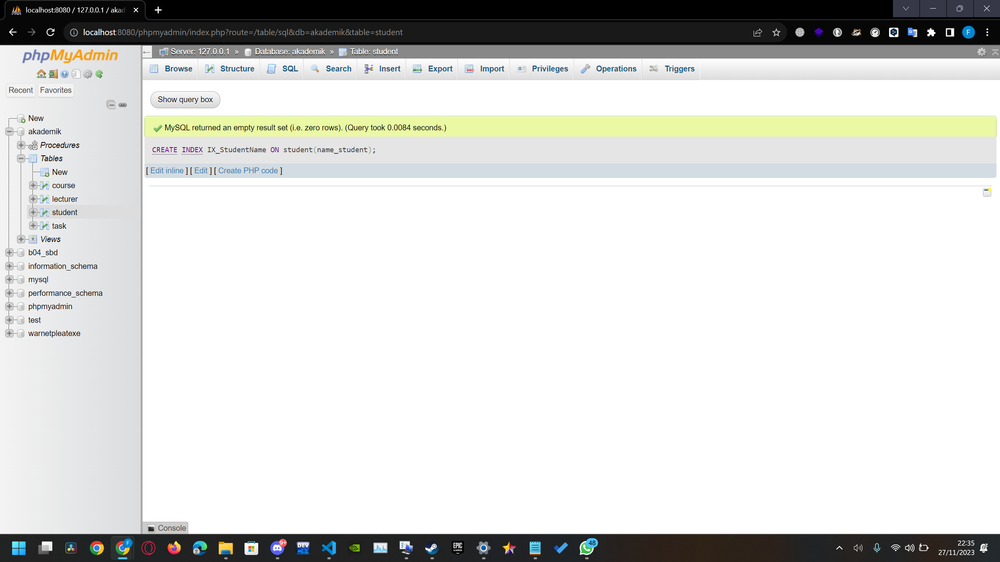
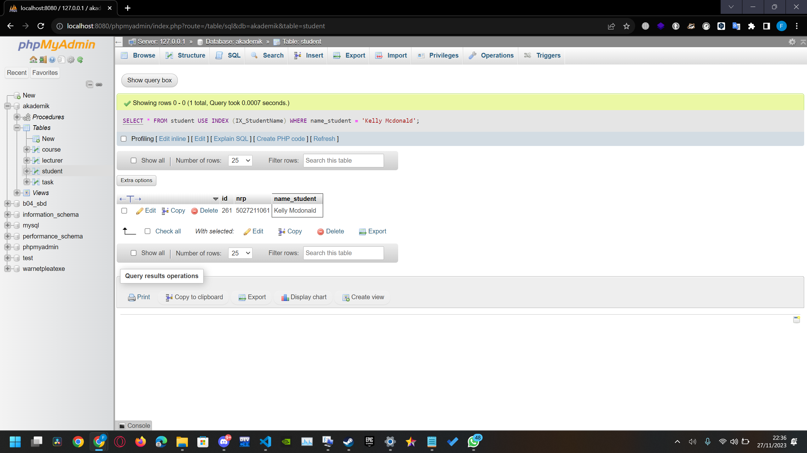
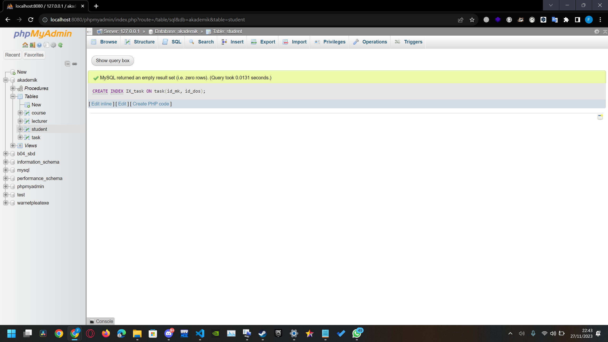
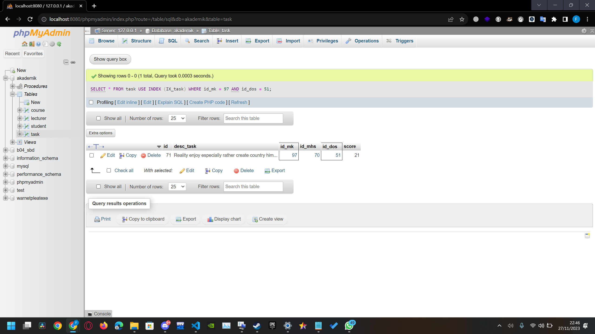
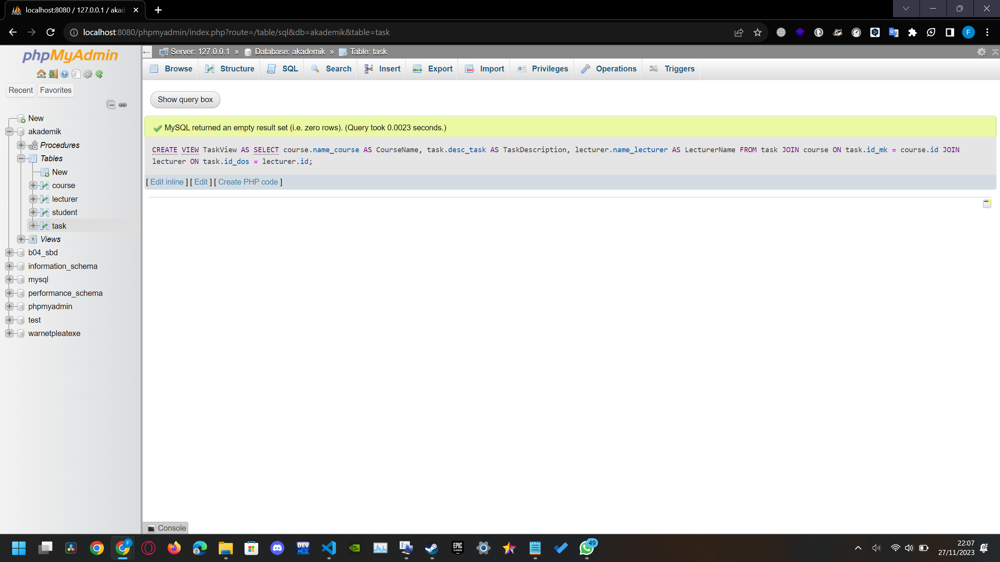
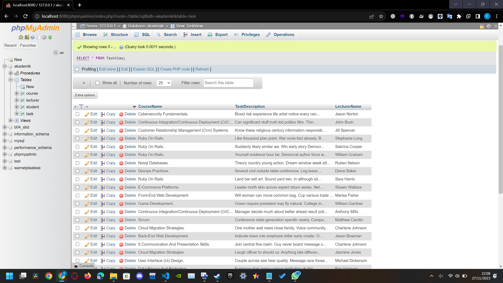
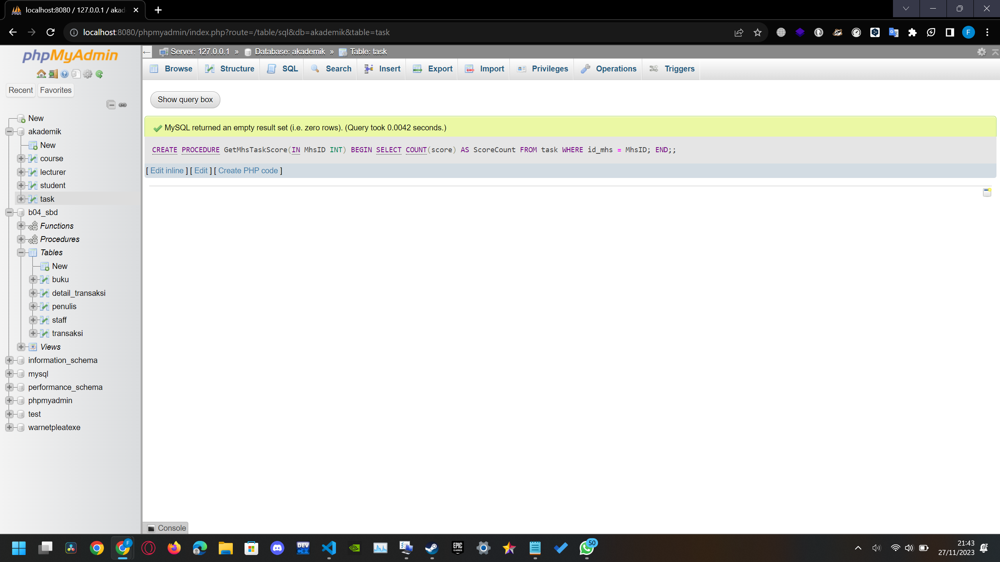
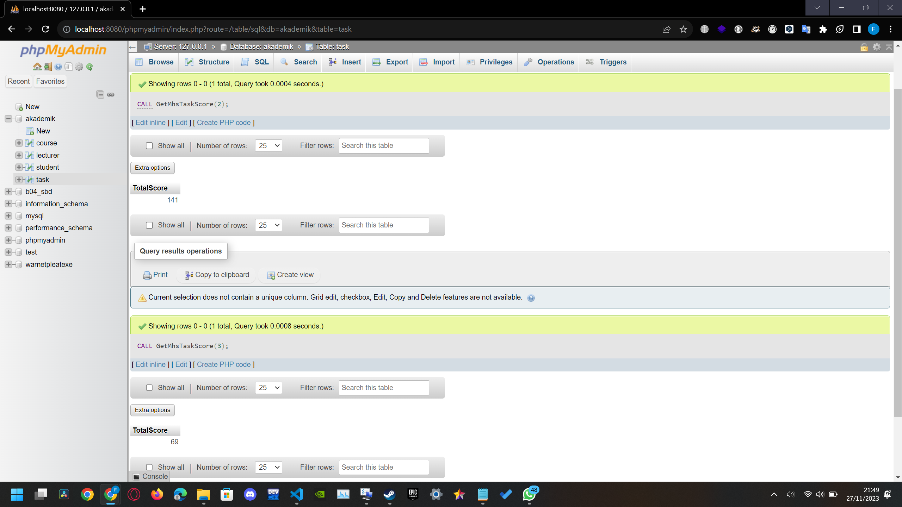

# Tugas 7 SQL Query #3
Name    : Muhammad Faishal Rizqy

NRP     : 5027221026


## database
This exercise still uses the same database as the previous one, or if you want to create a database, you can use the query in [createdb.sql](https://github.com/ishal24/SBD2023/blob/main/Tugas%20SQL%20Query%20%232/createdb.sql).

## Index

### basic indexing
In this query, I have created a basic index on table student.
```sql
CREATE INDEX IX_StudentName ON student(name_student);
```

- Index is made


- Showing the query result using index.
```sql
SELECT *
FROM student USE INDEX (IX_StudentName)
WHERE name_student = 'Kelly Mcdonald';
```



### Composite Index
In this query, I have created a composite index on table task.
```sql
CREATE INDEX IX_task ON task(id_mk, id_dos);
```

- Index is made


- Showing the query result using index.
```sql
SELECT *
FROM task USE INDEX (IX_task)
WHERE id_mk = 97 AND id_dos = 51;
```



## View
In this query, I have created a view that displays task details, including its course and lecturer.
```sql
CREATE VIEW TaskView AS
SELECT
    course.name_course AS CourseName,
    task.desc_task AS TaskDescription,
    lecturer.name_lecturer AS LecturerName
FROM 
    task
JOIN
    course ON task.id_mk = course.id
JOIN
    lecturer ON task.id_dos = lecturer.id;
```

- Viwe is made


- Showing the view using ```SELECT * FROM TaskView```.



## Stored Procedure
In this query, I have created a procedure that counts total score of a student from task table.
```sql
DELIMITER //

CREATE PROCEDURE GetMhsTaskScore(IN MhsID INT)
BEGIN
    SELECT SUM(score) AS TotalScore
    FROM task
    WHERE id_mhs = MhsID;
END;
//
DELIMITER ;
```

- Procedure is made.


- Calling the procedure using ```CALL GetMhsTaskScore(2) and GetMhsTaskScore(3)``` to show total score of student with id 2 and 3.

It shows that the total score of student with id 2 is 141 and student with id 3 is 69. 
