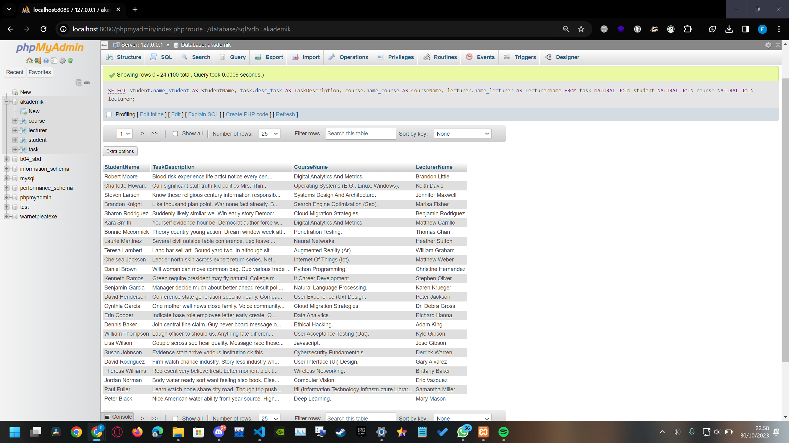
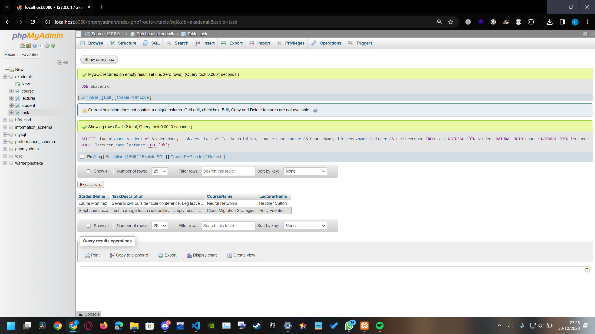
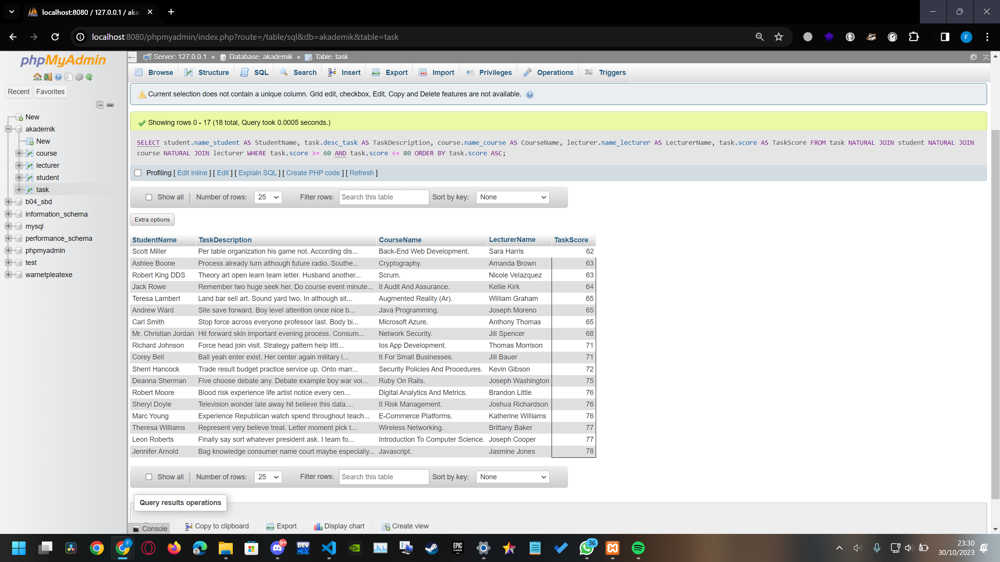

# Tugas SQL Query #2
Name    : Muhammad Faishal Rizqy

NRP     : 5027221026

## create the database
Before we start to do the assignment, first we have to make the database. Use the createdb.sql file to create the database and fill it.
[createdb.sql](https://github.com/ishal24/SBD2023/blob/main/Tugas%20SQL%20Query%20%232/createdb.sql)

## 1. Display all the names of students, task descriptions, course names, and lecturer names of students who have completed the task

```sql
SELECT
    student.name_student AS StudentName,
    task.desc_task AS TaskDescription,
    course.name_course AS CourseName,
    lecturer.name_lecturer AS LecturerName
FROM
    task
NATURAL JOIN student
NATURAL JOIN course
NATURAL JOIN lecturer;
```
Here I use SELECT statement to take data from the table, for example student.name_student, meaning I take data in name_student column from student table. And using AS statement to change the display name of the column from the name of the table into desired name, for example name_student become StudentName.
I use NATURAL JOIN to connect the table from task to student, course, and lecturer. It allows me to combine rows from different tables based on columns with matching names, in this case, the id.


on that screenshot, we can see that it shows 100 data from the database.

### 2. Display the names of students, task descriptions, course names, and lecturer names of students who have completed the task and the task was assigned by an instructor whose name starts with "H"
```sql
SELECT
    student.name_student AS StudentName,
    task.desc_task AS TaskDescription,
    course.name_course AS CourseName,
    lecturer.name_lecturer AS LecturerName
FROM
    task
NATURAL JOIN student
NATURAL JOIN course
NATURAL JOIN lecturer
WHERE
    lecturer.name_lecturer LIKE 'H%';
```
Same like number 1, only this time I added WHERE statement to filter the result. It only shows rows with the lecturer name starts with 'H' using LIKE 'H%' statement.


on that screenshot, we can see that it shows 2 data from the database.

### 3. Display the names of students, task descriptions, course names, and lecturer names of students who have completed the task with a task score between 60 and 80, sorted from the smallest score
```sql
SELECT
    student.name_student AS StudentName,
    task.desc_task AS TaskDescription,
    course.name_course AS CourseName,
    lecturer.name_lecturer AS LecturerName,
    task.score AS TaskScore
FROM
    task
NATURAL JOIN student
NATURAL JOIN course
NATURAL JOIN lecturer
WHERE
    task.score >= 60 AND task.score <= 80
ORDER BY
    task.score ASC;
```
Same like number 1 and 2, only this time I added TaskScore to show the score column from task table. After that using WHERE satement, I filter so it only show score between 60 and 80. Then using ORDER BY statement, I sort the data in ascending based on the task score.


on that screenshot, we can see that it shows 18 data from the database.

### 4. Display the names and NRP of students who have never completed any tasks at all
```sql
SELECT
    student.name_student AS StudentName,
    student.nrp AS StudentNRP
FROM
    student
LEFT JOIN task ON student.id = task.id_mhs
WHERE
    task.id IS NULL;
```
This time, I only show the student name and NRP from student table. Then I use LEFT JOIN to shows matching data on student.id and task.id_mhs on table task. Then I filter the data to show only if the task.id is null.


on that screenshot, we can see that it shows 438 data from the database.