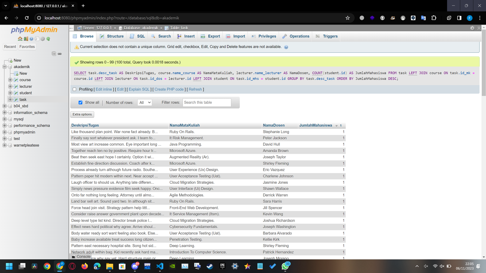

# Tugas SQL Query #3
Name    : Muhammad Faishal Rizqy

NRP     : 5027221026

## database
untuk latihan ini masih menggunakan database yang sama dengan database sebelumnya, atau jika ingin membuat database, bisa menggunakan query pada [createdb.sql](https://github.com/ishal24/SBD2023/blob/main/Tugas%20SQL%20Query%20%232/createdb.sql).

## 1. Tampilkan deskripsi tugas, nama mata kuliah, dan nama dosen dari tugas yang paling banyak dikerjakan oleh mahasiswa
```sql
SELECT
    task.desc_task AS DeskripsiTugas,
    course.name_course AS NamaMataKuliah,
    lecturer.name_lecturer AS NamaDosen,
    COUNT(student.id) AS JumlahMahasiswa
FROM
    task
LEFT JOIN course ON task.id_mk = course.id
LEFT JOIN lecturer ON task.id_dos = lecturer.id
LEFT JOIN student ON task.id_mhs = student.id
GROUP BY task.desc_task
ORDER BY JumlahMahasiswa DESC;
```
Pada soal ini, diminta untuk menampilkan tugas yang paling banyak dikerjakan oleh mahasiswa beserta nama mata kuliah dan dosennya. Disini saya mengambil deskripsi tugas dari task.desc_task, nama mata kuliah dari course dari course.name_course, dan nama dosen dari lecturer.name_lecturer. Saya juga menambahkan kolom JumlahMahasiswa untuk mengetahui berapa banyak mahasiswa yang mengambil tugas tersebut dengan COUNT(student.id).
Lalu saya menggunakan LEFT JOIN pada course.id, lecturer.id, dan student.id, yang cocok dengan id yang ada di task. Kemudian saya menggunakan grouping dengan task.desc_tesk. Selanjutnya melakukan sorting berdasarkan JumlahMahasiswa.


Dari gambar diatas, didapat 100 baris dengan Jumlah Mahasiswa terbanyak yang mengerjakan tugas adalah 1 dan semua baris menampilkan jumlah yang sama.


## 2. Tampilkan nama mata kuliah dan nama dosen yang memiliki paling banyak jenis tugas
Pada soal ini, diminta untuk menampilkan jenis tugas yang paling banyak oleh mata kuliah dan dosen.
- Menampilkan mata kuliah dengan jenis tugas terbanyak
```sql
SELECT
    course.name_course AS NamaMataKuliah,
    COUNT(task.id) AS JumlahTugas
FROM
    course
LEFT JOIN task ON course.id = task.id_mk
GROUP BY course.name_course
ORDER BY JumlahTugas DESC
LIMIT 1;
```
Disini saya mengambil nama mata kuliah dari ```course.name_course``` dan jumlah tugas dengan menghitung menggunakan ```COUNT(task.id)```. Kemudian saya melakukan ```LEFT JOIN``` untuk mengambil id mata kuliah yang cocok dengan id pada course. Lalu saya melakukan grouping dengan ```course.name_course```. Lalu saya melakukan sorting berdasarkan jumlah tugas secara descending agar nilai terbesar berada di paling atas. Lalu yang terakhir melakukan ```LIMIT 1``` untuk membatasi hasil hanya satu baris.


Pada gambar tersebut, terlihat bahwa hanya satu mata kuliah dengan jumlah tugas terbanyak sebanyak 7.


Pada gambar tersebut, saya menghilangkan ```LIMIT 1``` pada query untuk menampilkan semuanya dan didapati bahwa hanya satu mata kuliah dengan posisi pertama yaitu Ruby On Rails. Itu mengapa saya melimit hasilnya hanya satu baris.

- Menampilkan dosen dengan jenis tugas terbanyak
```sql
SELECT
    lecturer.name_lecturer AS NamaDosen,
    COUNT(task.id) AS JumlahTugas
FROM
    lecturer
LEFT JOIN task ON lecturer.id = task.id_dos
GROUP BY lecturer.name_lecturer
ORDER BY JumlahTugas DESC
LIMIT 2;
```
Disini saya mengambil nama dosen dari ```lecturer.name_lecturer``` dan jumlah tugas dengan menghitung menggunakan ```COUNT(task.id)```. Kemudian saya melakukan ```LEFT JOIN``` untuk mengambil id dosen yang cocok dengan id pada course. Lalu saya melakukan grouping dengan ```lecturer.name_lecturer```. Lalu saya melakukan sorting berdasarkan jumlah tugas secara descending agar nilai terbesar berada di paling atas. Lalu yang terakhir melakukan ```LIMIT 2``` untuk membatasi hasil hanya dua baris.


Pada gambar tersebut, terlihat bahwa ada dua nama dosen yang muncul dengan jumlah tugas sebanyak 4.


Pada gambar tersebut, saya menghilangkan ```LIMIT 2``` pada query untuk menampilkan semuanya dan didapati bahwa ada dua dosen dengan posisi pertama yaitu Charlene Johnson dan Shirley Fleming. Itu mengapa saya melimit hasilnya menjadi dua baris.


## 3. Tampilkan deskripsi tugas, nama mata kuliah, dan nama dosen dari tugas yang memiliki rata-rata nilai antara 70 sampai 80
```sql
SELECT
    task.desc_task AS DeskripsiTugas,
    course.name_course AS NamaMataKuliah,
    lecturer.name_lecturer AS NamaDosen,
    task.score AS NilaiTugas
FROM
    task
JOIN course ON task.id_mk = course.id
JOIN lecturer ON task.id_dos = lecturer.id
WHERE
    task.score BETWEEN 70 AND 80;
```


## 4. Tampilkan nama mahasiswa, NRP, dan nilai yang memiliki nilai dibawah rata-rata pada tugas yang memiliki kata 'car' di deskripsi
```sql
SELECT
    student.name_student AS NamaMahasiswa,
    student.nrp AS NRP,
	task.desc_task AS DeskripsiTugas,
    task.score AS Nilai
FROM
    task
JOIN student ON task.id_mhs = student.id
WHERE
    task.desc_task LIKE '%car%'
    AND task.score < (
        SELECT AVG(score) 
        FROM task 
        WHERE desc_task LIKE '%car%'
    );
```


## 5. Tampilkan deskripsi tugas, nama mata kuliah, dan nama dosen dari tugas yang memiliki nilai rata-rata dibawah rata-rata nilai semua tugas
```sql
SELECT
    task.desc_task AS DeskripsiTugas,
    course.name_course AS NamaMataKuliah,
    lecturer.name_lecturer AS NamaDosen,
    AVG(task.score) AS RataRataNilai
FROM
    task
JOIN course ON task.id_mk = course.id
JOIN lecturer ON task.id_dos = lecturer.id
GROUP BY task.desc_task, course.name_course, lecturer.name_lecturer
HAVING AVG(task.score) < (SELECT AVG(score) FROM task);
```

